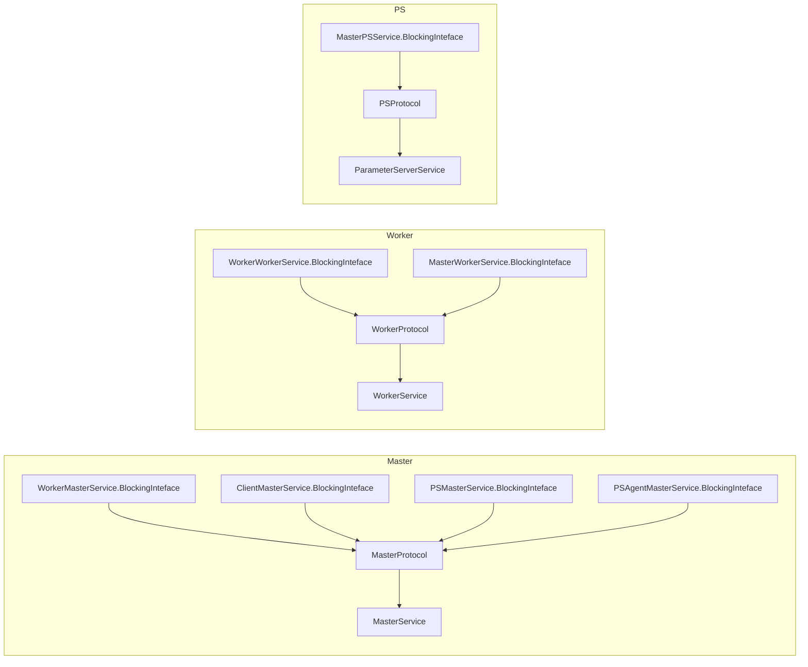

## 1. Protocal

协议层， 共有三组7个主要协议， 分别是：

- MasterProtocol： 运行于Master上， 主要有：
  - WorkerMasterService：用于Msater与Worker通讯
  - ClientMasterService：用于Msater与Client通讯
  - PSMasterService：用于Msater与Parameter Server通讯
  - PSAgentMasterService：用于Msater与PS Agent通讯
- WorkerProtocol：运行于Worker上， 主要有：
  - MasterWorkerService：用于Work与Master通讯
  - WorkerWorkerService：用于Worker之间的通讯
- PSProtocol：运行于PS上， 主要有：
  - MasterPSService

每个协议都对应一个protobuf文件，对protobuf文件生成代码得到WorkerMasterService， ClientMasterService，PSMasterService， PSAgentMasterService， MasterWorkerService， WorkerWorkerService， MasterPSService. 在这些XXXService中都有一个BlockingInteface接口。

这些协议分别负责两个实体对象（Msater, Worker, PS）之间的通讯，由于有些协议是运行于同一个实体对象中， 所发进行了聚合，具体如下：

**注：** PSProtocol, MasterProtocol, WorkProtocal都是接口，它们都集成了VersionedProtocol，具体的 实现类分别是：

- ParamererServerService
- MsaterService
- WorkerService

**注：** 这里的XXXService都是protobuf风格的， 使用不够友好

## TConnection

- MasterService --> MasterProtocol
- WorkerService --> WorkerProtocol
- PSService --> PSProtocol
- AsyncPSService --> PSProtocol.AsyncProtocol

## RpcServer
- getPort
- start
- stop
- join
- call
- getListenerAddress
- openServer
- getNumberOfConnections

> NettyServer

## Callback

## VersionedProtocol

