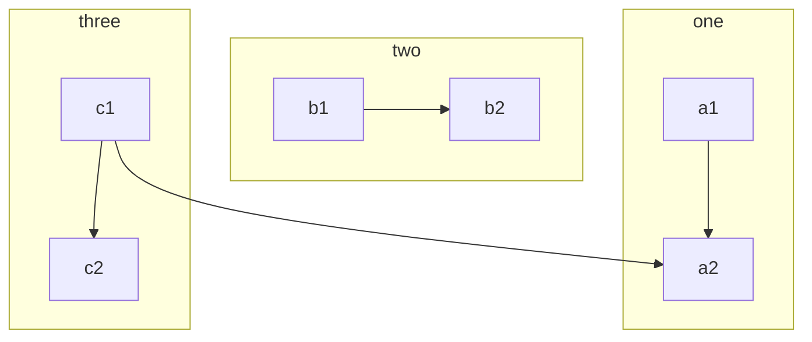

```mermaid

graph TD
	classDef default fill:#f0f,stroke:#333,stroke-width:4px;
    B["fa:fa-twitter for peace"]
    B-->C[fa:fa-ban forbidden]
    B-->D(fa:fa-spinner);
    B-->E(A fa:fa-camera-retro perhaps?);

style B fill:#f5f,stroke:#333,stroke-width:4px
style D fill:#ccf,stroke:#f66,stroke-width:2px,stroke-dasharray: 5, 5
linkStyle 3 stroke:#ff3,stroke-width:4px;
```

```
#quot
#9829
```