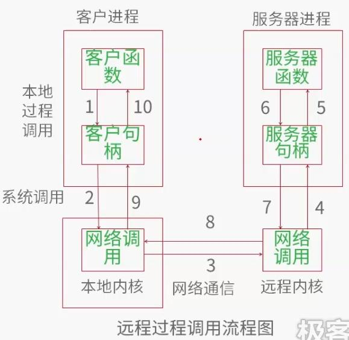
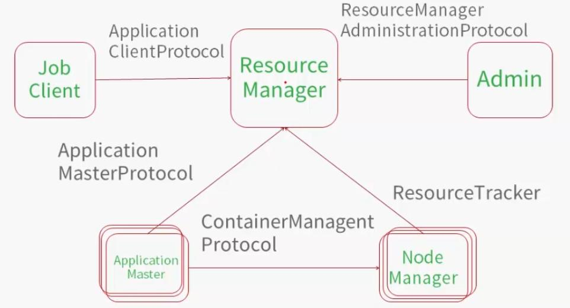

RPC (Remote Procedure Call Protocol), 远程过程调用协议, 它是通过网络从计算机程序上请求服务, 而不用了解底层网络技术的协议:
- server: 服务提供程序
- client: 请求程序

## 1. RPC的过程

1. 调用客户端句柄; 执行传送参数
2. 调用本地系统内核发送网络消息
3. 消息传送到远程主机
4. 服务器句柄得到消息并取得参数
5. 执行远程过程
6. 将远程的执行结果返回服务器句柄
7. 服务器句柄返回结果, 调用远程系统内核
8. 消息传回本地主机
9. 客户句柄由内核接收消息
10. 客户接收句柄返回的数据

##2. Yarn 中的RPC

- ApplicationClientProtocal: JobClient(作业提交客户端)与RM之间的通讯协议
  - JobClient通过该RPC协议提交应用程序, 查询应用程序的状态等
- ResourceManagerAdministrationProtocal: Admin(管理员)与RM之间的通讯协议
  - Admin通过该RPC协议更新系统配置文件, 比如节点黑名单, 用户队列权限等
- ApplicationMasterProtocal: AM与RM之间的通讯协议
  - AM通过该RPC协议注册和撤销自己, 并为各个任务申请资源
- ContainterManagementProtocal: AM与NM之间的通讯协议
  - AM通过该RPC要求NM启动或者停止Container, 获得各个Container的使用状态等信息
- ResourceTracker:  NM与RM之间的通讯协议
  - NM通过该RPC协议向RM注册, 并定时发送心跳信息汇报当前结点的资源使用情况和Container运行情况

## 3. Yarn中的事件驱动 

为了增大并发性, Yarn采用事件驱动的并发模型, 将各种处理逻辑抽象事件和调度器, 将事件处理过程用状态机表示.

**状态机**:如果一个对象其构成为若干个状态, 以及触发这些状态发生相互转移的事件, 那第此对象称为状态机. 对于状态机模式, 基本做法是根据事件和当前状态来执行下一步动作, 并设置下一次状态

状态机常常与生命周期本关, Yarn 中的状态机主要有:
- RMAPP:用于维护一个Application的生命周期
  + 实现类为RMAppIml
- RMAppAttempt: 用于维护一次试探运行的生命周期
  + 实现类为RMAppAttemptIml
- RMContainer: 用于维护一个已分配的最小资源单位Container的生命周期
  + 实现类为RMContainerIml
- RMNode: 用于维护一个NodeManager的生命周期
  - 实现类为RMNodeIml
